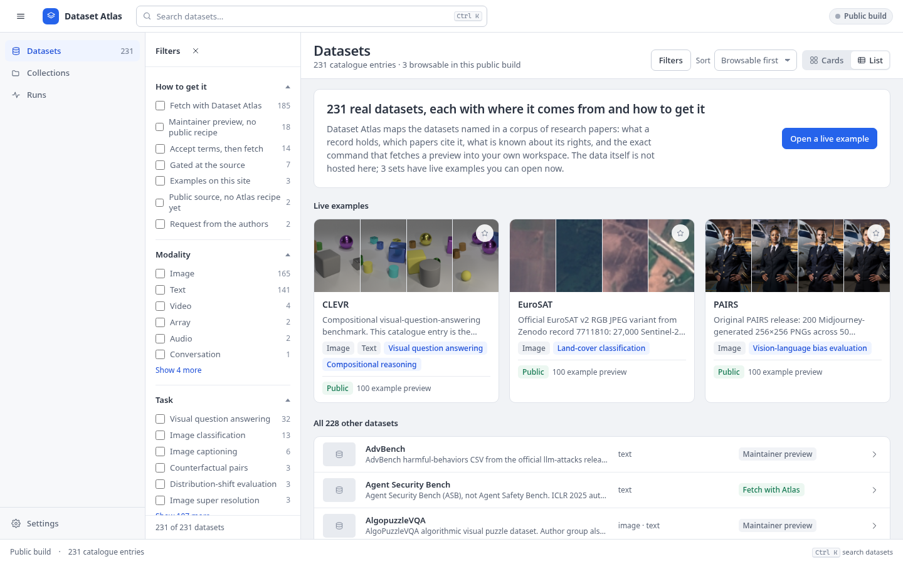
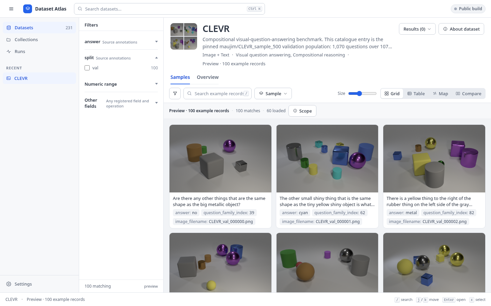
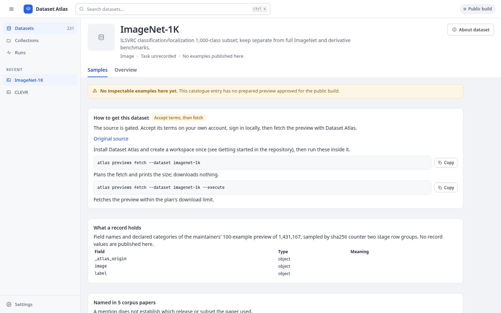

# Dataset Atlas

**See what is inside the datasets behind a body of research, and how to get each one.** Dataset Atlas is a catalogue of 231 real datasets named in 64 research papers, with real examples you can browse, filter and compare, a guide to fetching each dataset from its original publisher, and an optional local workbench for analysis. It runs on your machine. The same interface also runs as a static website.



## What you get

- **A catalogue you can trust.** Every entry says where the data comes from, what a record holds, which papers name it, what is known about its rights, and whether it works now, needs access, or needs an adapter. Aliases, views of other datasets and entries with nothing working are not listed ([why](registry/candidate_dispositions.yaml)).
- **Real examples.** 220 datasets have a 100-record preview of original data with annotations; 218 have a complete index you can filter and count exactly. Images, audio, video and 3D models open in their original form.
- **Reproducible selections.** Filters, samples and selections are stable and exchangeable, and carry the snapshot they were made on.
- **Optional analysis, kept local.** Detectors, embeddings, projections and local-model conversations work on the same samples. Nothing is sent to an external model unless you approve exactly what leaves your machine.
- **Your own datasets** sit beside the catalogue: folders, tables and Hugging Face datasets.



## Quick start

```bash
uv tool install ./dataset_atlas-0.2.0-py3-none-any.whl     # a release wheel; no Node, no checkout
atlas init ~/atlas && cd ~/atlas                           # a workspace with the catalogue, no data yet
atlas serve                                                # open http://127.0.0.1:8765/
atlas previews fetch --dataset mnist --execute             # plan, then fetch one preview from its publisher
```

A fresh workspace holds the catalogue and no data. Each dataset page says what you can do with it, and nothing downloads until you have seen the size and approved the plan. From a checkout: `uv sync && npm --prefix apps/web ci && npm --prefix apps/web run build && uv run atlas serve`. Python 3.11 to 3.14 on Linux or macOS.



## The public website

The static build (`docs/github-pages.md`) needs no Python and holds no dataset content beyond three reviewed example sets (CLEVR, EuroSAT, PAIRS). For every other dataset it shows the guide: how to obtain it, the field schema of its preview and the papers that name it.

## Where things are

| Path | What is there |
| --- | --- |
| `src/dataset_atlas/` | The Python package: API, adapters for each source format, preparation workers, query engine, analysis processors, publication. |
| `apps/web/` | The React interface, used by both the local workbench and the static site. |
| `registry/` | The catalogue: one YAML file per dataset (`datasets/`), preparation recipes (`recipes/`), paper inventories, publication approvals, and the record of what was removed and why. |
| `examples/` | Reviewed, redistributable example packs and the public schema and coverage snapshot. |
| `docs/` | Guides. Start at [docs/README.md](docs/README.md). |
| `reports/` | Dated verification receipts and the coverage matrix. See [reports/README.md](reports/README.md). |
| `tests/`, `scripts/` | The test suite and maintenance scripts. |
| `SPEC.md`, `ROADMAP.md` | The acceptance contract and the current state against it. |

## Status

A working release; the full v1 in [SPEC.md](SPEC.md) is not complete. **231 catalogue entries, 220 prepared previews, 21,532 preview records, 218 complete indices, 11 entries without a preview** (ten gated or request-only datasets with a known route, and PATA). Paper mentions do not by themselves settle which release or subset a paper used, so most identities stay marked as candidates until a person reviews them. Preview data stays local: only CLEVR, PAIRS and EuroSAT are approved for public redistribution. Current numbers and evidence: [ROADMAP.md](ROADMAP.md), [reports/final-status.json](reports/final-status.json), [reports/dataset_coverage.csv](reports/dataset_coverage.csv).

## Documentation

[Getting started](docs/getting-started.md) · [Adding your own datasets](docs/adding-your-own-datasets.md) · [Adding catalogue datasets](docs/adding-datasets.md) · [Storage](docs/storage.md) · [Development](docs/development.md) · [Publication](docs/publication.md) · [GitHub Pages](docs/github-pages.md)

The code is released under the [MIT licence](LICENSE). Dataset licences and terms belong to their publishers and are not changed by it: the data and media in this repository (the three approved example sets, schemas and catalogue metadata) keep the notices recorded in `registry/` and `licenses/`. Gated datasets are fetched with your own accepted terms and credentials; Dataset Atlas never accepts terms or applies for access for you.
